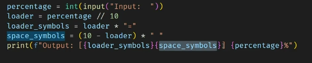
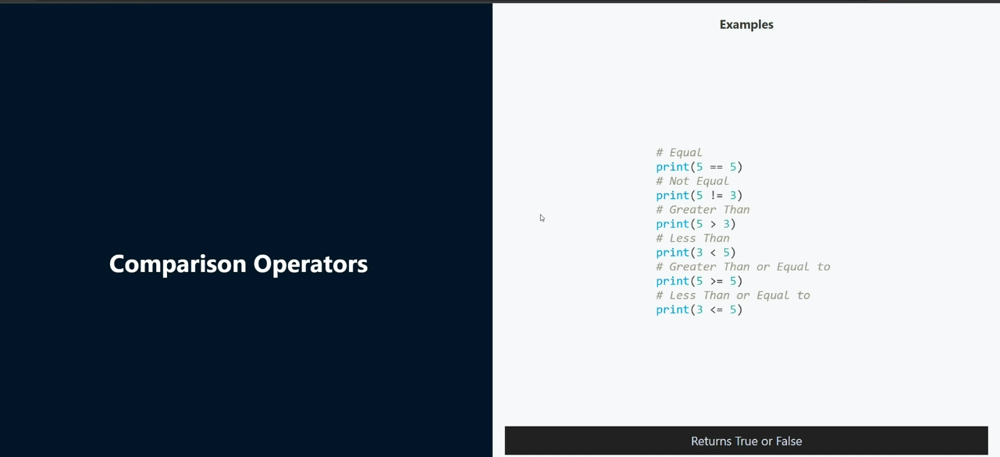

# Python - Day 03

- Operators II
- String methods
  1. `count()`
  2. `find()`
  3. `index()`
- List
- List methods

## Shortcuts

- `Alt + ⬆️` ➡️ for moving lines
- `!<tab>` ➡️ Boiler plate code
- `win + .` ➡️ emojis
- `ctrl + /` ➡️ comment
- `ctrl + <space>` ➡️ Auto complete
- `ctrl + d` ➡️ Multi cursor (Similar)
- `Hold Alt` ➡️ Multi cursor (Similar)
- `Ctrl + '`'` ➡️ Open and close terminal

## `fstring` - DX ⬆️

- `{}` ➡️ interpolation (substitute)
- `{}` ➡️ expressions are alllowed
- Auto coverts
- Readable

```py
print(f"My age is {age}")
print(f"She has {2*1000} followers 🎊")
```

## `Arithmetic Operators`

- `+` ➡️ Addition
- `-` ➡️ Subtraction
- `*` ➡️ Multiplication
- `/` ➡️ Division
- `%` ➡️ Modulus _(Remainder)_
- `**` ➡️ Exponent
- `//` ➡️ Floor Division _(Removes decimal point)_

```py
    floor = 7 // 3 #2
```

```py
    exponent = 2 ** 3 #8
```

```py
    mod = 3 % 2 #1
```

## Adding image

``

> Concatenate - **cannot mix** data types
> `str + int` ➡️ ❌

## Tables

| Operator | Example  | Output |
| -------- | :------: | -----: |
| `//`     | `7 // 2` |  $1600 |
| `**`     | `7 ** 2` |    $12 |
| `%`      | `7 % 2`  |     $1 |

## References

- [Markdown sheet cheat](https://www.markdownguide.org/basic-syntax/#headings)
- [Table](https://github.com/adam-p/markdown-here/wiki/markdown-cheatsheet#tables)

## Constants

- Always be in caps

```py
PI = 3.14
```

## Task 4



## Repl

### To enter

- py

### To exit

- exit()

## Comparison Operators

- `==` ➡️ Equal
- `!=` ➡️ Not Equal To
- `>` ➡️ Greater than
- `<` ➡️ Less than
- `>=` ➡️ Greater than and Equal to
- `<=` ➡️ Less than and Equal to

> > **All comparison operators return boolean**



## Logical Operators

> > **All comparison operators return boolean**

- `and`

  - If any is `False` then `False`
  - Only both `True` then `True`

  ```py
  print(True and True)
  ```

  | Operator          |  Output |
  | ----------------- | ------: |
  | `True and True`   |  `True` |
  | ` True and False` | `False` |
  | `False and True`  | `False` |
  | `False and False` | `False` |

- `or`
  - If any is `True` then `True`
  - Only both `False` then `False`
  - If any value is `True` the answer is `True`

```py
print(True or False)
```

| Operator         |  Output |
| ---------------- | ------: |
| `True or True`   |  `True` |
| ` True or False` |  `True` |
| `False or True`  |  `True` |
| `False or False` | `False` |

- `not`

```py
print(True not False)
```

```py
(3 < 4) and (10 >= 5) ➡️ True
(5 != 10) or (800 < 5) ➡️ True
( (80 % 5) == 0) and ( (3 * 6) == 35) ➡️ False
( 7 > 5 ) and (4 != 4 ) or (3 <= 10) ➡️ True

```

# Strings

## Index

- `[position]` ➡️ finds a letter in a string

```py
fav_movie = "John Wick"
print(fav_movie[0]) #J
```

## Negative Indexing

```py
print(fav_movie[-1]) #k
```

## Slice Operator

### **\*End index not included**

#### `(start:end)`

- `fav_movie[start:end]` ➡️ end index not included

```py
print(fav_movie[2:6]) #hn W
```

#### `[pos:]`

- copies string from position till the end

```py
print(fav_movie[2:])  # hn Wick
```

#### `[:]`

- copies the string
- same concept as `print[fav_movie[0:]`

```py
print(fav_movie[:]) #John Wick
```

#### `[start:end:step]`

- copies the string from start till end in increments of the step

```py
print(fav_movie[2:9:1])  # hn Wick
print(fav_movie[2:9:2])  # h ick
```

#### `[start:end:negative step]`

- reverse string, step < 0

```py
print(fav_movie[::-1])  # kciW nhoJ
print(fav_movie[-4::-1])  # W nhoJ
```

#### Replacing a letter

- Strings are immutable (cannot be changed)

```py
fav_hero = "The Hulk"
print(fav_hero[:4] + "h" + fav_hero[5:]) #The hulk
```

## Case Modifying Methods

- `upper()` ➡️ capitalizes every letter
- `lower() ` ➡️ every letter is in lowercase
- `capitalize()` ➡️ capitalizes only the first letter in a string
- `title()` ➡️ capitalizes every word in a string
- `swapcase()` ➡️ swaps the case of every letter

````py
catchphrase = "I am Groot"

print(catchphrase.upper())  # I AM GROOT
print(catchphrase.lower())  # i am groot
print(catchphrase.capitalize())  # I am groot
print(catchphrase.title())  # I Am Groot
print(catchphrase.swapcase())  # i AM gROOT
```
````

## Strip

- Removes only leading and trailing characters

```py
message = "  With great power comes great responsibility   "
clean_message = message.strip()
print(clean_message) #With great power comes great responsibility

coded_message = "********SO*S******"
decoded = coded_message.strip("*")
print(decoded)  # SO*S
```

- `lstrip()` ➡️ removes leading characters
- `rstrip()` ➡️ removes trailing characters

## count

- counts the number of times a word or letter appears in a string

```py
quote = "Dream is not something that you see in sleep, Dream is something that does not let you sleep"

print(quote.count("Dream")) #2
```

## replace

- replaces a character or word with something else

```py
print(quote.replace("Dream", "🛌💭"))
# 🛌💭 is not something that you see in sleep, 🛌💭 is something that does not let you sleep
```

-`replace(original, replaced, number of instances to be replaced)`

```py
print(quote.replace("Dream", "🛌💭", 1))
# 🛌💭 is not something that you see in sleep, Dream is something that does not let you sleep
```

## find

- finds the position of the first instance otherwise returns -1 if not found

```py
print(quote.find("something")) # 13
print(quote.find("**")) #  -1
```

## Dot Chaining

- Return the same data type

```py
clean_upper_msg = secret_message.strip().upper()
```

## Lexical Order

- Dictionary way of looking at it

```py
print("185" > "20") #false (is 1.8.5 greater than 2.0? No)
```
