# SQL

- Query - question or statement
- Not case sensitive - column names

## Exercise 1 — Tasks

1. Find the title of each film
   ```SQL
   SELECT title FROM movies;
   ```
2. Find the director of each film

   ```SQL
   SELECT director FROM movies;
   ```

3. Find the title and director of each film

   ```SQL
   SELECT title, director FROM movies;
   ```

4. Find the title and year of each film

   ```SQL
   SELECT title, year FROM movies;
   ```

5. Find all the information about each film

   ```SQL
   SELECT * FROM movies;
   ```

   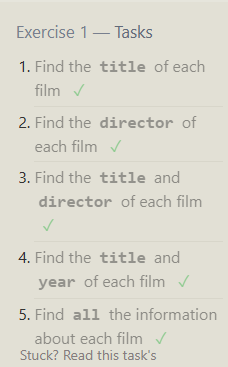

## Exercise 2 — Tasks

1. Find the movie with a row id of 6
   ```sql
    SELECT *
    FROM movies
    where id = 6;
   ```
2. Find the movies released in the years between 2000 and 2010

   ```sql
   SELECT *
   FROM movies
   where year between 2000 and 2010;
   ```

- Select all data from movies where the year matches condition
- Alternate way:
  ```sql
  SELECT *
  FROM movies
  WHERE year >= 2000 and year <=2010
  ```

1. Find the movies not released in the years between 2000 and 2010

   ```sql
    SELECT *
    FROM movies
    where year not between 2000 and 2010;
   ```

2. Find the first 5 Pixar movies and their release year

   ```sql
    SELECT *
    FROM movies
    where id in (1,2,3,4,5);
   ```

   - Alternate way

   ```sql
       Select title, year
       FROM movies
       LIMIT 5;
   ```

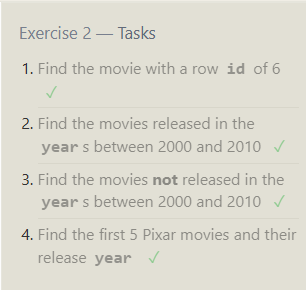

## Exercise 3 — Tasks

1. Find all the Toy Story movies

   ```sql
    SELECT *
    FROM movies
    WHERE title like "Toy Story%";
   ```

2. Find all the movies directed by John Lasseter

   ```sql
    SELECT *
    FROM movies
    WHERE director = "John Lasseter";
   ```

   - Can use `LIKE`

3. Find all the movies (and director) not directed by John Lasseter

   ```sql
    SELECT *
    FROM movies
    WHERE director != "John Lasseter";
   ```

   - Can use `NOT LIKE`
   -

4. Find all the WALL-\* movies

   - Answer 1

   ```sql
    SELECT *
    FROM movies
    WHERE title like "WALL-%";
   ```

   - Answer 2

   ```sql
   SELECT *
   FROM movies
   WHERE title like "WALL-_";
   ```

   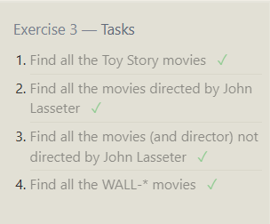

# Exercise 4 — Tasks

1. List all directors of Pixar movies (alphabetically), without duplicates

   ```sql
    SELECT DISTINCT director
    FROM movies
    ORDER BY director;
   ```

2. List the last four Pixar movies released (ordered from most recent to least)

   ```sql
    SELECT *
    FROM movies
    ORDER BY year DESC
    LIMIT 4;
   ```

3. List the first five Pixar movies sorted alphabetically

   ```sql
    SELECT *
    FROM movies
    ORDER BY title
    LIMIT 5;
   ```

4. List the next five Pixar movies sorted alphabetically

   ```sql
    SELECT *
    FROM movies
    ORDER BY title
    LIMIT 5 OFFSET 5;
   ```

   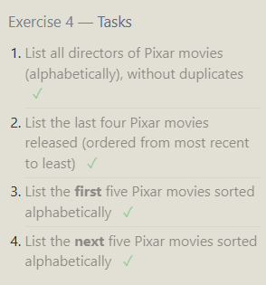

## Review 1 — Tasks

1. List all the Canadian cities and their populations

   ```sql
    SELECT *
    FROM north_american_cities
    WHERE country = "Canada";
   ```

2. Order all the cities in the United States by their latitude from north to south

   ```sql
    SELECT *
    FROM north_american_cities
    WHERE country = "United States"
    ORDER BY latitude DESC;
   ```

3. List all the cities west of Chicago, ordered from west to east

   ```sql
    SELECT * FROM north_american_cities
    WHERE longitude < -87.629798
    ORDER BY longitude;
   ```

   - not recommended to hard code -87.629798 (longitude)
   - Recommended Answer (Sub-Query)

     ```sql
     SELECT *
     FROM north_american_cities
     Where longitude < (
     SELECT longitude
     FROM north_american_cities
     Where city = "Chicago"
     )
     Order By longitude;
     ```

   ```

   ```

4. List the two largest cities in Mexico (by population)

   ```sql
    SELECT * FROM north_american_cities
    WHERE country = "Mexico"
    ORDER BY population DESC
    LIMIT 2;
   ```

5. List the third and fourth largest cities (by population) in the United States and their population

   ```SQL
    SELECT * FROM north_american_cities
    WHERE country = "United States"
    ORDER BY population DESC
    LIMIT 2 OFFSET 2;
   ```

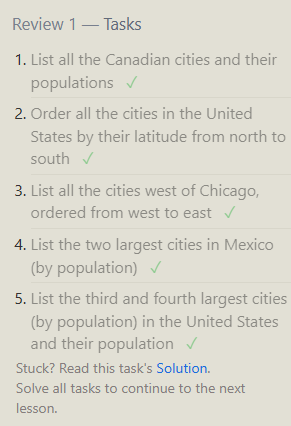

## Exercise 6 — Tasks

1. Find the domestic and international sales for each movie
   ```sql
   SELECT * FROM movies
   INNER JOIN boxoffice
   on movies.id = boxoffice.movie_id;
   ```
2. Show the sales numbers for each movie that did better internationally rather than domestically

   ```sql
   SELECT * FROM movies
   INNER JOIN boxoffice
   on movies.id = boxoffice.movie_id
   WHERE boxoffice.international_sales > boxoffice.domestic_sales;
   ```

3. List all the movies by their ratings in descending order

   ```sql
   SELECT * FROM movies
   INNER JOIN boxoffice
   on movies.id = boxoffice.movie_id
   ORDER BY boxoffice.rating DESC;
   ```

   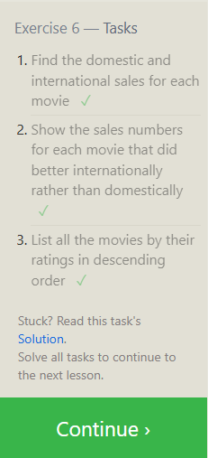

## Exercise 7 — Tasks

1. Find the list of all buildings that have employees

   ```sql
   SELECT DISTINCT building FROM employees;
   ```

2. Find the list of all buildings and their capacity

   ```sql
   SELECT * FROM buildings;
   ```

3. List all buildings and the distinct employee roles in each building (including empty buildings)
   ```sql
   SELECT DISTINCT role, building_name FROM buildings
   LEFT JOIN employees
   ON buildings.building_name = employees.building;
   ```
   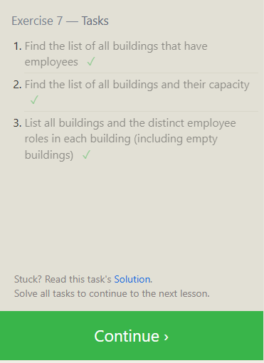

## Exercise 8 — Tasks

1. Find the name and role of all employees who have not been assigned to a building

   ```sql
   SELECT name, role FROM employees
   WHERE building IS NULL;
   ```

2. Find the names of the buildings that hold no employees
   ```sql
   SELECT * FROM buildings
   LEFT JOIN employees ON employees.building = buildings.building_name
   WHERE name IS NULL;
   ```

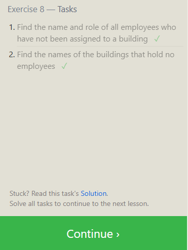

## Exercise 9 — Tasks

1. List all movies and their combined sales in millions of dollars

   ```sql
   SELECT movies.title, (boxoffice.domestic_sales + boxoffice.international_sales) / 1000000 AS Sum_Sales
   FROM movies
   INNER JOIN boxoffice ON movies.id = boxoffice.movie_id;
   ```

2. List all movies and their ratings in percent

   ```sql
   SELECT movies.title, boxoffice.rating * 10 AS Rating_Percent
   FROM movies
   INNER JOIN boxoffice ON movies.id = boxoffice.movie_id;
   ```

3. List all movies that were released on even number years

   ```sql
   SELECT movies.title, movies.year FROM movies
   WHERE movies.year % 2 = 0;
   ```

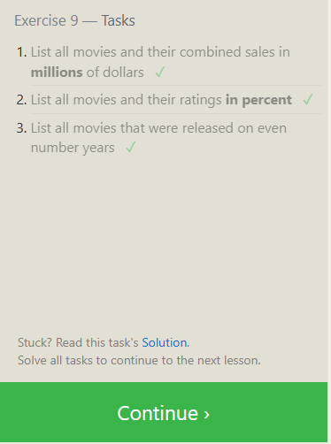

## Exercise 10 — Tasks

1. Find the longest time that an employee has been at the studio

   ```sql
   SELECT MAX(years_employed) AS Longest_Time FROM employees;
   ```

2. For each role, find the average number of years employed by employees in that role

   ```sql
   SELECT role, AVG(years_employed) AS Average_Years FROM employees
   GROUP BY role;
   ```

3. Find the total number of employee years worked in each building

   ```sql
   SELECT building, SUM(years_employed) AS Sum_Employees FROM employees
   GROUP BY building;
   ```

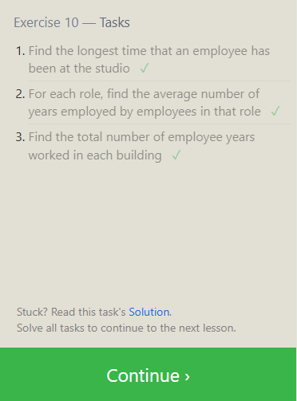

## Exercise 11 — Tasks

1. Find the number of Artists in the studio (without a HAVING clause)

   ```sql
   SELECT COUNT(role) AS Num_Artists FROM employees
   WHERE role = "Artist";
   ```

2. Find the number of Employees of each role in the studio

   ```sql
   SELECT role, COUNT(name) AS Num_Role FROM employees
   GROUP BY role;
   ```

3. Find the total number of years employed by all Engineers

   ```sql
   SELECT role, SUM(years_employed) AS Num_Years_Engineers FROM employees
   WHERE role = "Engineer";
   ```

   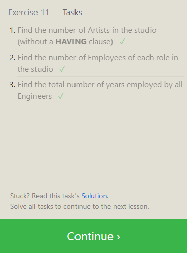

## Exercise 12 — Tasks

1. Find the number of movies each director has directed

   ```sql
   SELECT director, count(director) AS Num_Directed FROM movies
   GROUP BY director;
   ```

2. Find the total domestic and international sales that can be attributed to each director
   ```sql
   SELECT movies.director, SUM(boxoffice.domestic_sales + boxoffice.international_sales) AS Total_Sales
   FROM movies
   INNER JOIN boxoffice ON movies.id = boxoffice.movie_id
   GROUP BY director;
   ```
   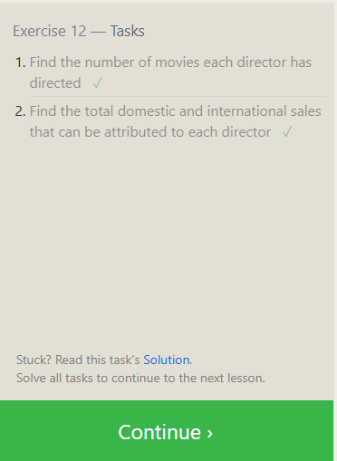

## Exercise 13 — Tasks

1. Add the studio's new production, Toy Story 4 to the list of movies (you can use any director)

   ```sql
   INSERT INTO movies
   VALUES (4, "Toy Story 4", "John Lasseter", 2025, 120 )
   ```

2. Toy Story 4 has been released to critical acclaim! It had a rating of 8.7, and made 340 million domestically and 270 million internationally. Add the record to the BoxOffice table.

   ```sql
   INSERT INTO boxoffice
   VALUES (4, 8.7, 340000000, 270000000)
   ```

   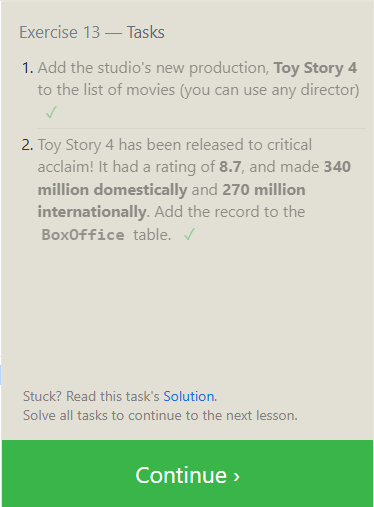

## Exercise 14 — Tasks

1. The director for A Bug's Life is incorrect, it was actually directed by John Lasseter

   ```sql
   SELECT *
   FROM movies
   WHERE year > 2005;
   ```

   ```sql
   UPDATE movies
   SET director = "John Lasseter"
   WHERE id = 2;
   ```

2. The year that Toy Story 2 was released is incorrect, it was actually released in 1999

   ```sql
   SELECT *
   FROM movies
   WHERE id = 3;
   ```

   ```SQL
   UPDATE movies
   SET year = 1999
   WHERE id = 3;
   ```

3. Both the title and director for Toy Story 8 is incorrect! The title should be "Toy
   Story 3" and it was directed by Lee Unkrich

   ```sql
   SELECT *
   FROM movies
   WHERE id = 11;
   ```

   ```sql
   UPDATE movies
   SET title = "Toy Story 3", director = "Lee Unkrich"
   WHERE id = 11;
   ```

   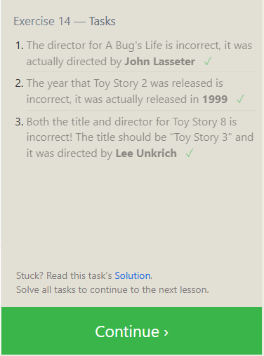
