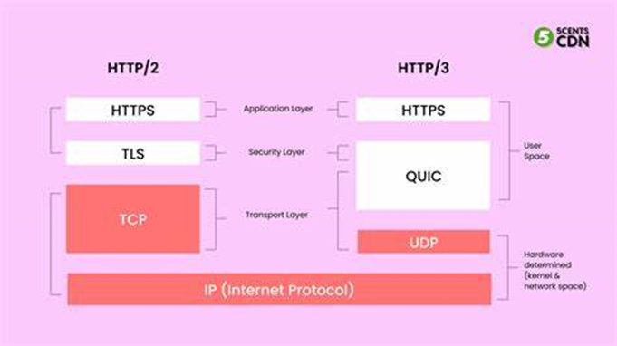
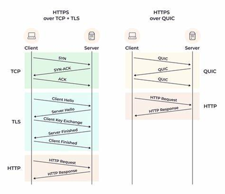

# **HTTP2 vs HTTP3**

_by Diyali Devraj_

## **What is HTTP?**

- HTTP is `Hypertext Transfer Protocol` which enables the transfer of data between a client and a server
- It is the foundation of data communication for WWW `(World Wide Web) `

## **What is HTTP2?**

- HTTP2 is the second version of the HTTP network, specifically curated to address performance issues and limitations of HTTP1.1 and improve the efficiency of web communications.
- Because HTTP2 is such an advanced protocol, it doesn’t require sub-versions (eg. HTTP2.1)
- HTTP2 improves performance by prioritizing data throughout the loading process.

## **What is HTTP3?**

- HTTP3 is the latest major version of HTTP.
  - HTTP3 is like the `e-mail` of today
  - HTTP2 as sending and receiving `physical letters in the post box`
  - HTTP1.1 as `writing a letter and sending it with a carrier pigeon`
- HTTP3 `complements` or `builds` on HTTP1.1 and HTTP2.

  

- HTTP3 was created to enable a fast, secure and reliable web connection across many types of devices by resolving HTTP2’s transport problems.
- HTTP3 uses QUIC and a multiplexed transport protocol built on UDP
- QUIC stands for Quick UDP Internet Connections, as the name suggests QUIC ensures faster and accurate data transmission.

## **Problems solved transitioning from HTTP2 to HTTP3**

### Problems HTTP2 solved

1. HTTP2 supported multiplexing (multiplexing is a way to send multiple signals at the same time in the form of a single, complex signal)
2. HTTP2 supported Servers Push (Servers Push is a performance technique that sends resources to a client before they know it will be needed)
3. HTTP2’s performance improved from HTTP1.1
4. HTTP2 provided stream prioritization which ensured that critical files or resources were delivered first.

### Problems HTTP3 solved

1. HTTP3 increases performance from HTTP2 specifically around fetching multiple files simultaneously
2. Since HTTP3 uses UDP as the transport protocol, if a packet gets dropped, it only affects that one stream and not all of them. Unlike HTTP2 that uses TCP which leads to a problem called Head-of-line blocking.
3. HTTP3’s QUIC is designed to be fast, and support switching rapidly between networks and uses UDP
4. HTTP3’s QUIC is encrypted by default making HTTP3 safer than HTTP2
5. HTTP3 developed a way to deter slow performance when a smartphone switches from WiFi to cellular data.

`Structural difference between HTTP2 and HTTP3`

`HTTP3 QUIC replaces the TCP+TLS`

Good work
